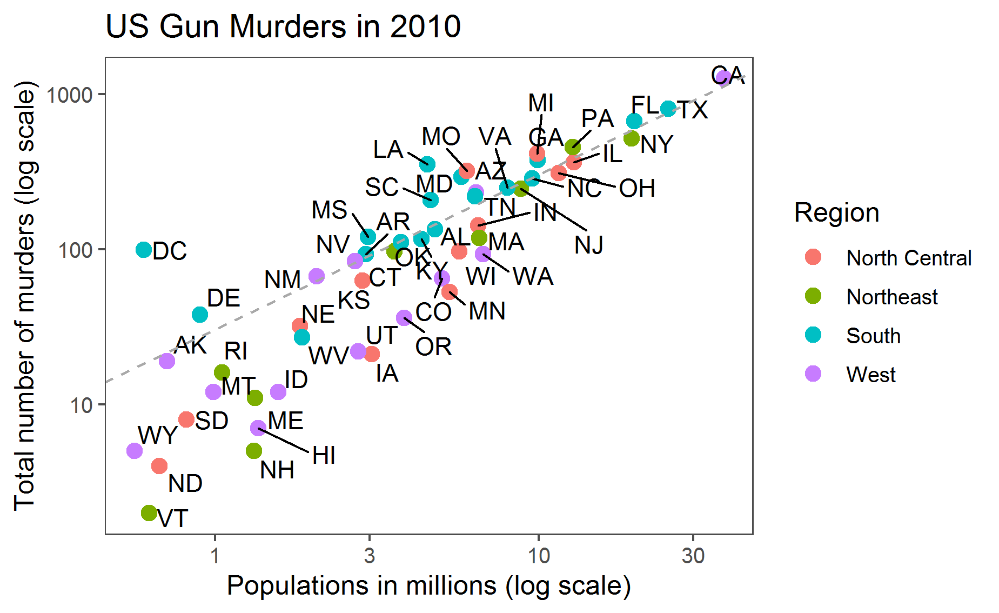

Report on Gun Murders
================
Vishal Jotwani
2020-03-27

Introduction
------------

This is a report on 2010 gun murder rates obtained from FBI reports. The original data was obtained from [this Wikipedia page](https://en.wikipedia.org/wiki/Murder_in_the_United_States_by_state).

We are going to use the following libraries:

``` r
library(tidyverse)
library(ggrepel)
library(ggthemes)
library(ggrepel)
```

and load the data we already wrangled:

``` r
load("rdas/murders.rda")
```

Murder rate by Population in millions for every State
--------------------

We note the large state to state variability by generating scatterplot showing the murder rate by population in millions.



We note that for south region most of the states are above country's average murder rate.